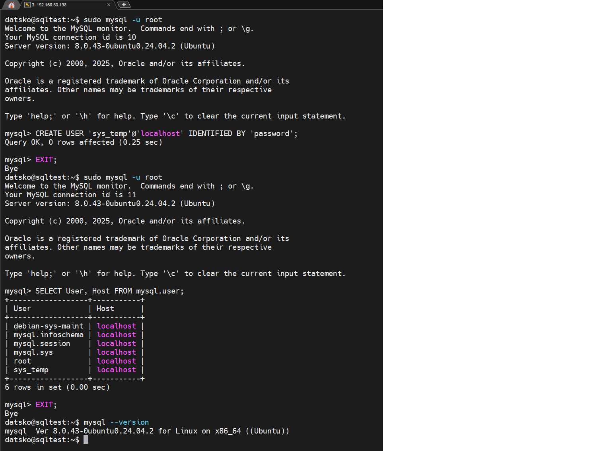
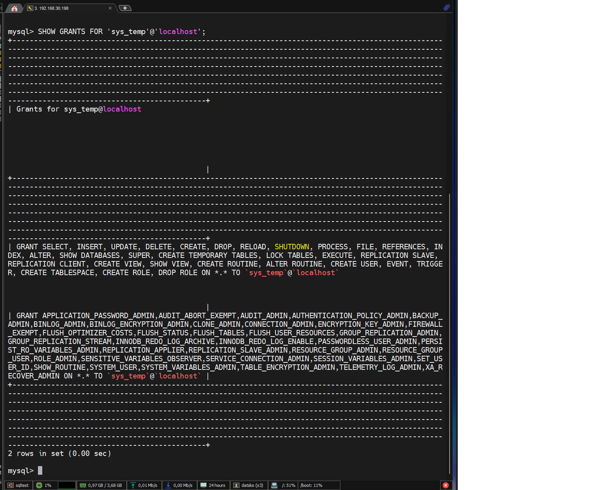
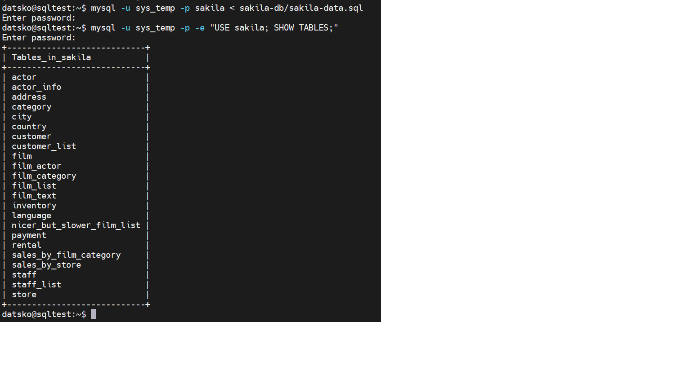

# Домашнее задание к занятию "`Работа с данными (DDL/DML)`" - `Дацко Иван`

### Инструкция по выполнению домашнего задания

   1. Сделайте `fork` данного репозитория к себе в Github и переименуйте его по названию или номеру занятия, например, https://github.com/имя-вашего-репозитория/git-hw или  https://github.com/имя-вашего-репозитория/7-1-ansible-hw).
   2. Выполните клонирование данного репозитория к себе на ПК с помощью команды `git clone`.
   3. Выполните домашнее задание и заполните у себя локально этот файл README.md:
      - впишите вверху название занятия и вашу фамилию и имя
      - в каждом задании добавьте решение в требуемом виде (текст/код/скриншоты/ссылка)
      - для корректного добавления скриншотов воспользуйтесь [инструкцией "Как вставить скриншот в шаблон с решением](https://github.com/netology-code/sys-pattern-homework/blob/main/screen-instruction.md)
      - при оформлении используйте возможности языка разметки md (коротко об этом можно посмотреть в [инструкции  по MarkDown](https://github.com/netology-code/sys-pattern-homework/blob/main/md-instruction.md))
   4. После завершения работы над домашним заданием сделайте коммит (`git commit -m "comment"`) и отправьте его на Github (`git push origin`);
   5. Для проверки домашнего задания преподавателем в личном кабинете прикрепите и отправьте ссылку на решение в виде md-файла в вашем Github.
   6. Любые вопросы по выполнению заданий спрашивайте в чате учебной группы и/или в разделе “Вопросы по заданию” в личном кабинете.
   
Желаем успехов в выполнении домашнего задания!
   
### Дополнительные материалы, которые могут быть полезны для выполнения задания

1. [Руководство по оформлению Markdown файлов](https://gist.github.com/Jekins/2bf2d0638163f1294637#Code)

---

### Задание 1

### 1.1 Установка MySQL 8.0+ на Ubuntu 24.04

sudo apt update
sudo apt install mysql-server -y
mysql --version
sudo systemctl start mysql
sudo systemctl status mysql
sudo mysql_secure_installation

### 1.2 Создание пользователя sys_temp

sudo mysql -u root
CREATE USER 'sys_temp'@'localhost' IDENTIFIED BY 'password';
EXIT;

### 1.3 Получение списка пользователей

sudo mysql -u root
SELECT User, Host FROM mysql.user;
EXIT;

### 1.4 Выдача всех прав пользователю sys_temp

sudo mysql -u root
GRANT ALL PRIVILEGES ON *.* TO 'sys_temp'@'localhost';
FLUSH PRIVILEGES;
EXIT;

### 1.5 Просмотр прав пользователя sys_temp

sudo mysql -u root
SHOW GRANTS FOR 'sys_temp'@'localhost';
EXIT;

### 1.6 Смена метода аутентификации и подключение от sys_temp

sudo mysql -u root
ALTER USER 'sys_temp'@'localhost' IDENTIFIED WITH mysql_native_password BY 'password';
FLUSH PRIVILEGES;
EXIT;
##### Подключение от имени sys_temp:
mysql -u sys_temp -p
-- (ввести пароль: password)
EXIT;

### 1.6–1.7 Скачивание и восстановление базы sakila

sudo apt install unzip -y
cd ~
wget https://downloads.mysql.com/docs/sakila-db.zip
unzip sakila-db.zip
##### Создание базы и импорт:
mysql -u sys_temp -p -e "DROP DATABASE IF EXISTS sakila; CREATE DATABASE sakila;"
mysql -u sys_temp -p sakila < sakila-db/sakila-schema.sql
mysql -u sys_temp -p sakila < sakila-db/sakila-data.sql

### 1.8 Получение списка таблиц (для скриншота)

mysql -u sys_temp -p -e "USE sakila; SHOW TABLES;"

---

### Задание 2

В базе данных `sakila` присутствуют как таблицы, так и представления (views).  
Поскольку **представления не имеют первичных ключей**, в таблице ниже указаны только **базовые таблицы** (`BASE TABLE`).

Для таблиц с **составным первичным ключом** перечислены все входящие в него столбцы.

| Таблица             | Первичный ключ (PK)        |
|---------------------|----------------------------|
| actor               | `actor_id`                 |
| address             | `address_id`               |
| category            | `category_id`              |
| city                | `city_id`                  |
| country             | `country_id`               |
| customer            | `customer_id`              |
| film                | `film_id`                  |
| film_actor          | `actor_id`, `film_id`      |
| film_category       | `film_id`, `category_id`   |
| inventory           | `inventory_id`             |
| language            | `language_id`              |
| payment             | `payment_id`               |
| rental              | `rental_id`                |
| staff               | `staff_id`                 |
| store               | `store_id`                 |

